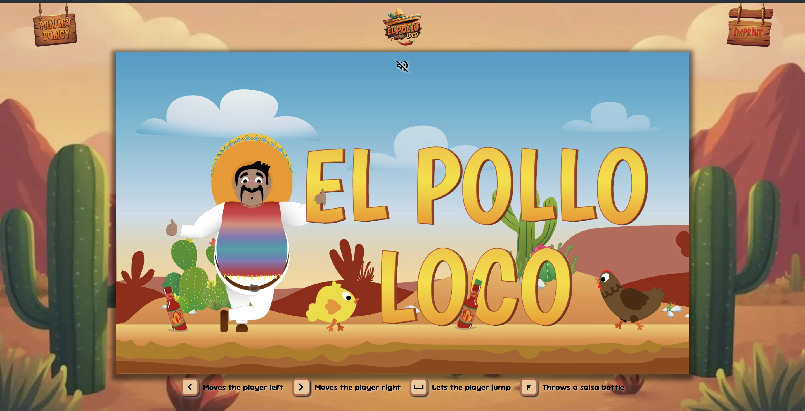

# El Pollo Loco



### 📋 Overview

El Pollo Loco is a browser-based jump'n'run game built with object-oriented JavaScript. Players navigate a character through challenging levels, avoiding obstacles and facing off against a giant, crazy chicken! The game's characters, enemies, and game elements are organized using object-oriented code structuring, resulting in a dynamic and interactive experience right in the browser.

## 🛠️ Built with

- HTML
- CSS / SCSS
- JS

## ⚙️ How to Use

1. Clone the repository:
   ```bash
   git clone <your-repository-url>
   ```

2. Navigate to the project directory:
   ```bash
   cd el-pollo-loco
   ```

## ✍️ Author

 - Chris Noack (CN Security & Systems)
 - [Website](https://christian-noack.com)
